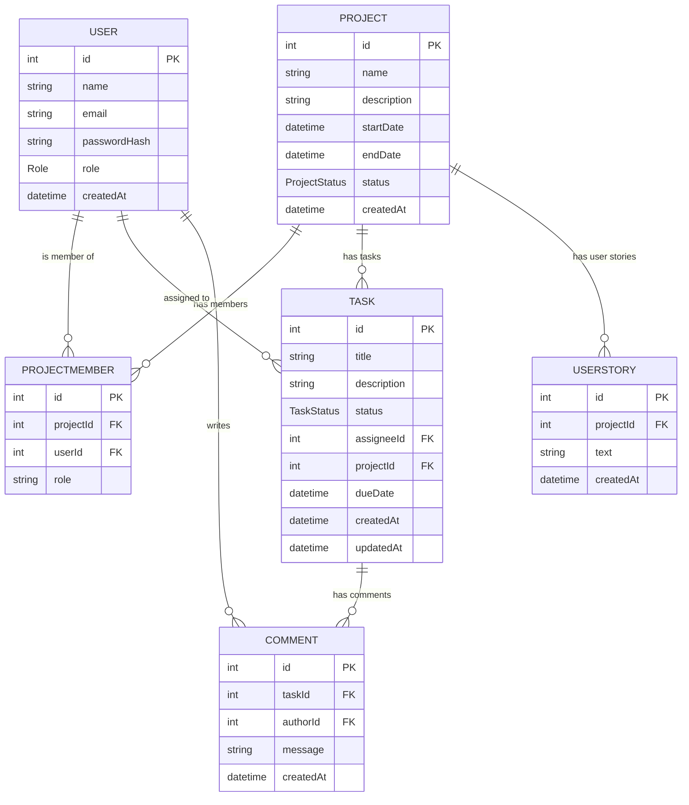

# DevPilot
Full-stack project management app to organize projects, assign tasks, collaborate with teams, and track progress. Built with **Next.js** (frontend), **Node.js/Express** (backend), **Prisma ORM**, and **PostgreSQL**.
[](https://devpilot.hubzero.in)

## 🌐 Deployment Setup

DevPilot is split into **frontend** and **backend**, deployed separately for flexibility and performance.

### Frontend
- Built with **Next.js**.  
- Hosted on **Vercel** (automatic deployments from GitHub).  
- Benefits:
  - Fast global CDN delivery
  - Automatic SSL/TLS
  - Built-in CI/CD with GitHub integration
- Communicates with the backend via API requests to a public URL (through Cloudflare Tunnel).

### Backend
- Built with **Node.js/Express** and **Prisma ORM** for database access.  
- Runs on my **personal laptop server** (Ubuntu) hosting:
  - PostgreSQL database
  - Node.js backend
  - Optional services (Prisma migrations, Plex, Home Assistant, etc.)
- Exposed to the internet using **Cloudflare Tunnel**:
  - Secure public URL for your local server
  - Acts as a reverse proxy
  - Provides automatic HTTPS and DDoS protection
  - No need to open router ports

### How it Works
1. Frontend (Vercel) sends API requests to the backend via the Cloudflare Tunnel URL.  
2. Tunnel forwards requests securely to my local backend server.  
3. Backend communicates with the PostgreSQL database.  
4. Responses are returned to the frontend, providing dynamic project/task data.

### Advantages
- **Decoupled architecture:** Frontend and backend are independent for easier updates.  
- **Secure local hosting:** Backend stays on my laptop but is safely exposed.  
- **Fast frontend delivery:** Vercel CDN ensures quick UI load worldwide.  
- **Flexibility:** Update backend code locally without redeploying the frontend.


---

## 📚 Table of Contents
- How to Run the Project
  - Prerequisites
  - Local Development
- API Endpoints Summary
- Database / ER Diagram
- Assumptions and Improvements Possible
- Libraries Used
- Author / Contact
- License


---

## 🚀 How to Run the Project

### Prerequisites
- Node.js (v18+ recommended)
- npm or yarn
- PostgreSQL (local or cloud instance)

>The backend uses Prisma for ORM and requires a DATABASE_URL environment variable.

---
### Local Development

1. **Clone the repository**
```bash
git clone https://github.com/Rifaque/DevPilot.git
```
2. **Install dependencies**
```bash
cd backend
npm install
cd ../frontend
npm install
```
3. **Set up environment variables**
**Backend `.env` example:**
```
DATABASE_URL, PORT, JWT_SECRET, GROQ_API_KEY 
```
**Frontend `.env` example:**
```
NEXT_PUBLIC_API_BASE, NEXTAUTH_SECRET
```
4. **Run database migrations and seed data**
```bash
npx prisma migrate dev --name init
npx prisma db seed
```
5. **Start server**
Backend:
```bash
npm run dev
```
Frontend:
```bash
npm run dev
```
6. **Access the app**
- Frontend → http://localhost:3000
- Backend API → http://localhost:4000/api

---

## 🧩 API Endpoints Summary
- **Auth**
  - **POST** `/api/auth/register` — Register a new user (not used in current version)
  - **POST** `/api/auth/login` — Login and receive JWT
- **Users**
  - **GET** `/api/users` — List all users
- **Projects**
  - **GET** `/api/projects` — List user’s projects
  - **GET** `/api/projects/:id` — Get project (with members & tasks)
  - **POST** `/api/projects` — Create project
  - **DELETE** `/api/projects/:id` — Delete project
  - **POST** `/api/projects/:id/members` — Add member
  - **GET** `/api/projects/:id/metrics` — Get project metrics
- **Tasks**
  - **POST** `/api/tasks/:projectId/tasks` — Create task under project
  - **GET** `/api/tasks/:projectId/tasks` — List tasks for project
  - **PUT** `/api/tasks/task/:id` — Update task
  - **DELETE** `/api/tasks/task/:id` — Delete task
- **Admin**
  - **GET** `/api/admin/metrics` — Get admin metrics
  - **GET** `/api/admin/users` — List all users
  - **PUT** `/api/admin/users/:id` — Update user role
  - **DELETE** `/api/admin/users/:id` — Delete user
  - **GET** `/api/admin/tasks` — List all tasks
  - **POST** `/api/admin/users` — Create user
- **AI User Stories (Bonus)**
  - **POST** `/api/ai/generate-user-stories` — Generate User Stories from GROQ API

> For more info on the API, visit [Swagger API Docs](https://apidevpilot.hubzero.in/api-docs/) or check out `DevPilot API.postman_collection.json`

---

## 🗄 Database / ER Diagram

### Database Structure Overview

#### Users
- Stores all users of the system.
- **Fields:** `id`, `name`, `email`, `passwordHash`, `role` (ADMIN / MANAGER / DEVELOPER), `createdAt`
- **Relations:**
  - Many-to-many with `Project` through `ProjectMember`
  - One-to-many with `Task` (as `assignee`)
  - One-to-many with `Comment` (as author)

#### Projects
- Represents projects in the system.
- **Fields:** `id`, `name`, `description`, `startDate`, `endDate`, `status` (ACTIVE / ON_HOLD / COMPLETED), `createdAt`
- **Relations:**
  - Many-to-many with `User` through `ProjectMember`
  - One-to-many with `Task`
  - One-to-many with `UserStory`

#### ProjectMember
- Junction table for many-to-many relationship between `User` and `Project`.
- **Fields:** `id`, `projectId`, `userId`, `role` (e.g., Manager, Developer)

#### Tasks
- Represents tasks assigned to users within a project.
- **Fields:** `id`, `title`, `description`, `status` (TODO / IN_PROGRESS / DONE), `assigneeId`, `projectId`, `dueDate`, `createdAt`, `updatedAt`
- **Relations:**
  - Belongs to a `Project`
  - Assigned optionally to a `User`
  - Has many `Comment`s

#### Comments
- Stores comments on tasks.
- **Fields:** `id`, `taskId`, `authorId`, `message`, `createdAt`
- **Relations:**
  - Belongs to a `Task`
  - Written by a `User`

#### UserStory
- Represents user stories for a project.
- **Fields:** `id`, `projectId`, `text`, `createdAt`
- **Relations:**
  - Belongs to a `Project`

#### Enums
- **Role:** ADMIN, MANAGER, DEVELOPER
- **TaskStatus:** TODO, IN_PROGRESS, DONE
- **ProjectStatus:** ACTIVE, ON_HOLD, COMPLETED


---

## 💡 Assumptions and Improvements Possible

### Assumptions
- Role-based access: `admin`, `project_manager`, `developer`
- Tasks belong to one project
- Projects have multiple members via a junction table
- JWT authentication

### Potential Improvements
- Real-time updates via WebSockets (Socket.io / Pusher)
- Notifications for task assignments and comments
- Search and filtering across all entities
- Audit logs for change tracking
- Advanced RBAC — fine-grained permissions per project

---

## 📦 External Libraries

This project uses several external libraries, each serving a specific purpose:

- **Next.js** – Frontend framework for React-based pages and server-side rendering.  
- **Node.js / Express** – Backend framework for building API endpoints.  
- **Prisma** – ORM for database modeling, migrations, and queries.  
- **PostgreSQL** – Relational database for storing project, user, task, and comment data. 
- **dotenv** – Load environment variables from `.env` files.  
- **bcryptjs** – Password hashing for secure user authentication.  
- **morgan** – HTTP request logger middleware for backend debugging.  
- **groq-sdk** – SDK for querying content from Sanity or GROQ-based APIs.  
- **jsonwebtoken (jwt)** – Generate and verify JSON Web Tokens for authentication.  
- **next-auth** – Authentication library for Next.js apps.  

Additional libraries for UI, development, or testing are listed in `package.json`.

---

## Author
**Rifaque Ahmed Akrami**  
Email: rifaque123@gmail.com
LinkedIn: [Rifaque Ahmed Akrami](https://www.linkedin.com/in/rifaque-akrami/)
Portfolio: [Portfolio](https://hubzero.in/rifaque)

---

## License
This project is licensed under the **MIT License**.
See the `LICENSE` file for details.
